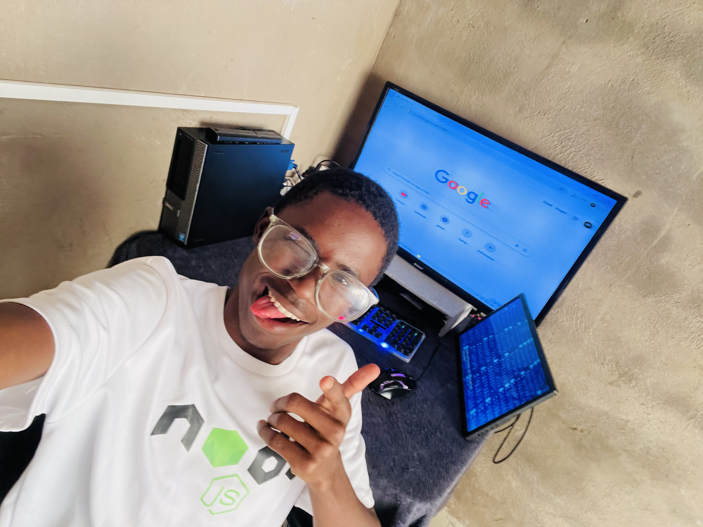

## Ordn Mash (ordain mthembeni) GitHub

<!-- IMG_E9411.JPG -->

  

#### I'm currently working on NLP (Natural Language Processing), I'm approaching this with Neural Networks.
I've very exciting projects under (NLP) you can go through my REPOs and take a look😄

#### I'm currently learning LLMs (Large Language Models), which covers bigger Neural Networks Architectures.
It's satisfying to learn this stuff because it reveals how good LLMs could be and how they work in the low levels of its cores.

#### I'm looking to collaborate on an Open Source NLP research or engineering.
I think it could be so beneficial for upcoming Machine Learning engineers to work on building an Open Source Language Model including myself.

#### I'm looking for help with, System deployment.
It could be so helpful if I could learn how to deploy systems like "Model that relies on local computer processor" and how it could work independently.

#### Ask me about (Neural Networks).
I'd love to communicate with the blocks of NNs, doesn't matter who you're!

#### To Simple reach me:
quick send message on my gmail: ordnmash@gamil.com
or send message on my whatsapp: +27791859943

#### Fun fact is that I'm still 19 and very passionated about Deep Leaning and Neural Networks.
I'd wish to work on real projects that could benefit people!

<!--
**Ordnmash/Ordnmash** is a ✨ _special_ ✨ repository because its `README.md` (this file) appears on your GitHub profile.

Here are some ideas to get you started:

- 🔭 I’m currently working on ...
- 🌱 I’m currently learning ...
- 👯 I’m looking to collaborate on ...
- 🤔 I’m looking for help with ...
- 💬 Ask me about ...
- 📫 How to reach me: ...
- 😄 Pronouns: ...
- ⚡ Fun fact: ...
-->
