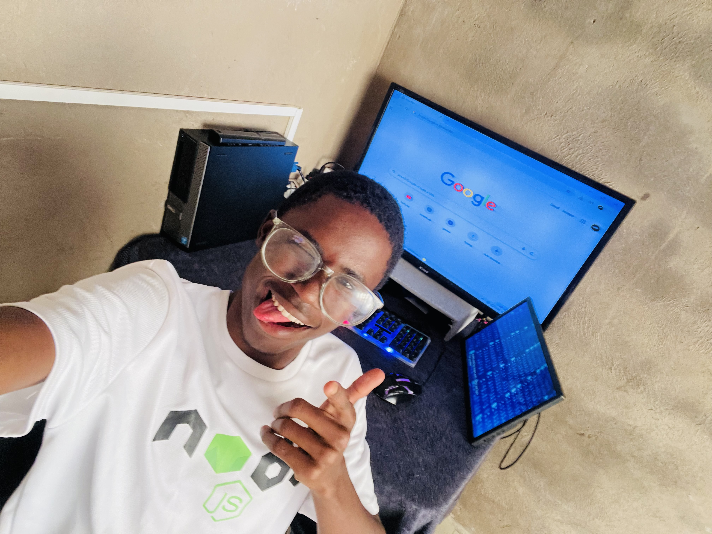

## Ordn Mash (ordain mthembeni) GitHub

<!-- IMG_E9411.JPG -->

  

#### I'm currently working on NLP (Natural Language Processing), I'm approaching this with Neural Networks.
I've very exciting projects under (NLP) you can go through my REPOs and take a look😄

#### I'm currently learning LLMs (Large Language Models), which covers bigger Neural Networks Architectures.
It's satisfying to learn this stuff because it reveals how good LLMs could be and how they work in the low levels of their cores.

#### I'm open to collaborate on an Open-Source/work NLP research or engineering.
I think it could be so beneficial for upcoming Machine Learning engineers to work on building an Open Source Language Model, including myself.

#### Ask me about (Neural Networks).
I'd love to communicate with the blocks of Neural Networks, doesn't matter who you're! we'll definitely have a good conversation over this!

#### To Simple reach me:
quick send message on my gmail: ordnmash@gamil.com

<!--
**Ordnmash/Ordnmash** is a ✨ _special_ ✨ repository because its `README.md` (this file) appears on your GitHub profile.

Here are some ideas to get you started:

- 🔭 I’m currently working on ...
- 🌱 I’m currently learning ...
- 👯 I’m looking to collaborate on ...
- 🤔 I’m looking for help with ...
- 💬 Ask me about ...
- 📫 How to reach me: ...
- 😄 Pronouns: ...
- ⚡ Fun fact: ...
-->
